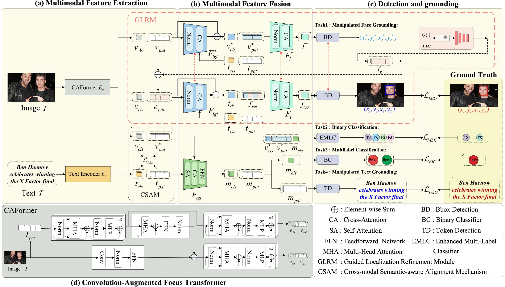

# Multimodal Deepfake Detection via Coarse-Aware Localization Refinement and Semantic Alignment

---

## 📖 Paper Overview

**CALS** is a unified framework for **Detecting and Grounding Multi-modal Media Manipulations (DGM⁴)**. Our method addresses the challenging task of multimodal deepfake detection by jointly enhancing detection accuracy and localization precision across visual and textual modalities.

### 🔍 Key Highlights

- **Guided Localization Refinement Module (GLRM):**  
 Enhances tampering region prediction by refining coarse localization cues without requiring multi-stage processing, improving spatial precision for pixel-level manipulation detection.

- **Convolutionally Augmented Focused Transformer (CAFormer):**  
 A hybrid architecture that integrates multi-scale convolutional branches with Transformer-based global modeling, facilitating robust cross-modal feature fusion and comprehensive visual-textual understanding.

- **Cross-Modal Semantic-Aware Alignment Mechanism (CSAM):**  
 Introduces contrastive learning with dynamic boundary constraints and hard negative mining to promote semantic consistency between image and text modalities, significantly improving detection performance.


<p align="center">
 
</p>

---


## 🚀 Getting Started

### Prerequisites

- Python 3.8+
- PyTorch 1.12+
- CUDA 11.6+
---

### Installation

1. Clone the repository:
2. git clone https://github.com/your-username/CALS.git
3. cd CALS
---

### 🙏 Acknowledgements
We sincerely thank the authors of [MultiModal-DeepFake](https://github.com/rshaojimmy/MultiModal-DeepFake) for their excellent work.  
We heavily used the code from their repository in developing this project.


---

### 📚 Citation
If you find our work helpful, please cite our paper:
```bash
bibtex@article{hu2024multimodal,
  title={Multimodal Deepfake Detection via Coarse-Aware Localization Refinement and Semantic Alignment},
  author={Hu, Bingwen and Zhou, Jun and Zheng, Zhedong and Wang, Yaxiong and Wu, Aming and Yang, Yi},
  journal={Pattern Recognition},
  year={2024},
  publisher={Elsevier}
}

  <sub>Built with ❤️ for advancing multimodal deepfake detection research</sub>
</div>
```
